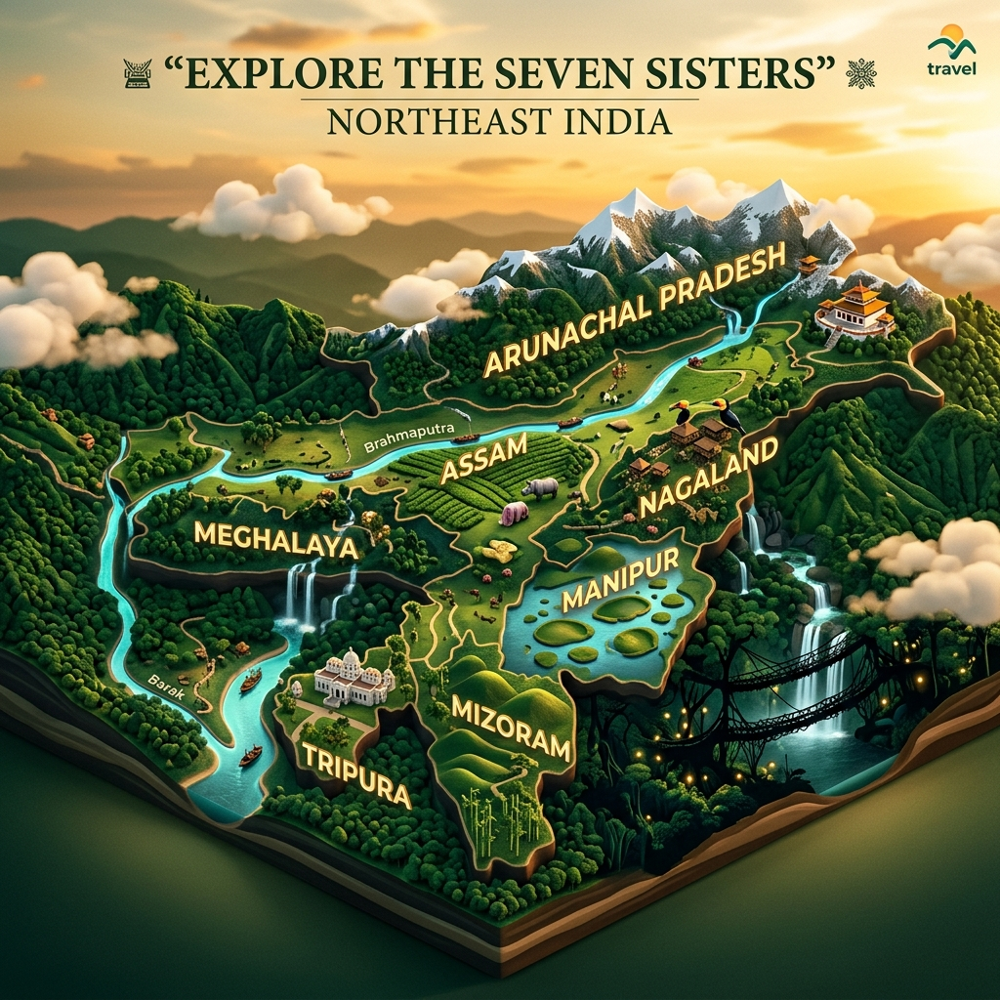
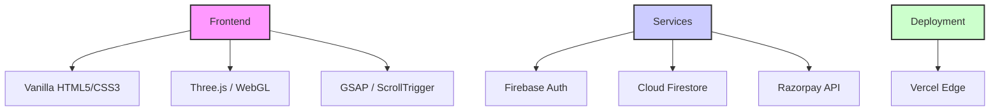

<div align="center">
  
  
  # 🧭 ASHTADISHA
  ### Gateway to the Seven Sisters of Northeast India
  
  [](https://ashtadisha.vercel.app)
  [](https://firebase.google.com)
  [](https://threejs.org)
  
  <p align="center">
    <b>जहाँ कोहरा पहाड़ से मिलता है। Where Mist Meets Mountain.</b><br />
    A luxury, bilingual travel portal immersive experience.
  </p>
</div>

---

## 📸 Immersive Experience

<div align="center">
  
  <br />
  <i>Modern. Aesthetic. Immersive. Built for the modern traveler.</i>
</div>

---

## ✨ Features

- 🗺️ **The Seven Sisters** — Interactive states guides for Assam, Meghalaya, Nagaland, Manipur, Mizoram, Tripura, and Arunachal Pradesh.
- 🎨 **Aesthetic Auth** — Custom-built, glassmorphic Firebase Authentication system (Email/Social).
- 🧠 **AI Travel Planner** — Intelligent itinerary generation for personalized journeys.
- 💳 **Seamless Payments** — Secure Razorpay integration for instant bookings.
- 📊 **User Dashboard** — Real-time booking management and travel history through Firestore.
- 🕹️ **3D Visuals** — Hardware-accelerated Three.js environments and GSAP-powered motion design.

---

## 🛠️ High-End Tech Stack



---

## 🚀 Dev Setup

Ashtadisha uses **ES Modules** (import/export), so it requires a local server to run.

```bash
# Option 1: Double-click run_website.bat (Windows)
# Automatically uses python server.py if available.

# Option 2: Python (Preferred)
python server.py

# Option 3: Manual Python server
python -m http.server 8000
```

---

## 📂 Architecture

```text
├── index.html              # Immersive SPA Entry
├── dashboard.html          # Dynamic User Portal
├── assets/
│   ├── auth/               # Aesthetic UI Assets
│   └── readme/             # 3D README Visuals
├── js/
│   ├── auth.js             # Firebase Auth Core
│   ├── firebase.js         # Firestore & Database
│   ├── payment.js          # Razorpay Logic
│   └── main.js             # Three.js & UI orchestration
└── css/
    ├── main.css            # Modular CSS Entry
    └── auth.css            # Glassmorphism Design
```

---

<div align="center">
  
  <br />
  <b>Ashtadisha — Defining Northeast Tourism for the Digital Age.</b>
</div>
